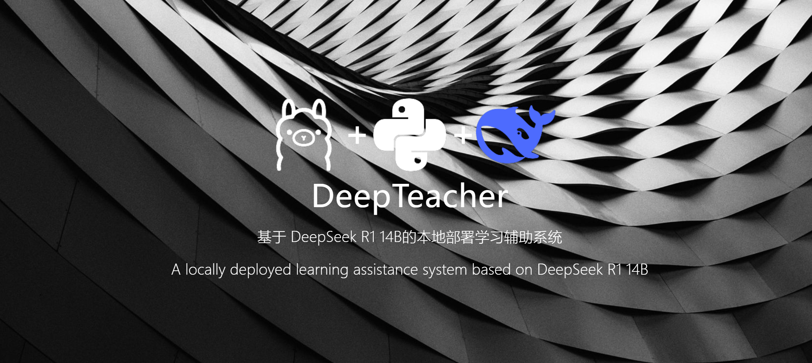

<div align="center">

  <!---->
<p align="center">
  
</p>

  <p align="center">
  <a href="https://huggingface.co/deepseek-ai/deepseek-coder-14b-instruct"></a>
  <a href="https://www.python.org"></a>
  <a href="https://github.com/Steven-ZN/DeepPlaylist?tab=MIT-1-ov-file"></a>
  <a href="https://github.com/Steven-ZN/DeepPlaylist/stargazers"></a>
</p>

</div>


A real-time intelligent assistant that **analyzes your screen**, understands what you’re doing, and explains it like a patient teacher


##  功能 

- **截图分析**：按下 `F8` 自动截屏当前主屏幕；
- **图像理解**：通过 `llava-phi3:3.8b` 模型进行图像内容识别；
- **深度讲解**：将识别内容交给 `deepseek-llm:7b` 模型进行教学化分析；
- **语音播报**：微软 Edge TTS将讲解内容朗读
- 全流程本地运行


* 已安装 [Ollama](https://ollama.com) 并配置本地模型


## 启动模型（两个命令行窗口）

```bash
ollama run llava-phi3:3.8b
```

> 负责图像理解，输出对屏幕内容的视觉描述。

```bash
ollama run deepseek-llm:7b
```

> 接收图像描述，输出深入讲解


## 启动

在 PyCharm、VSCode 或第三个终端中运行：

```bash
python main.py
```

按下 `F8` 即可开始分析。


## 使用

1. 打开你想让 AI 分析的界面（比如代码、论文、题目…）
2. 按下 `F8` 触发自动截屏；
3. 程序将：

   * 使用 LLaVA 识别图像内容
   * 使用 DeepSeek 模型生成中文讲解
   * 通过 Edge TTS 自动朗读输出
4. 按下 `ESC` 退出程序


## 示例

```
[LLaVA] This image contains a text editor with code...
[DeepSeek] 这段代码是用于图像分类任务，使用了 ResNet 结构…
```


##  注意

* 请确保你的电脑音频设备可用，否则 `playsound` 播报会失败；
* 显卡需要支持 16GB 显存
* 若使用 macOS / WSL，请使用替代音频模块
* 欢迎 Star / Fork / issue


